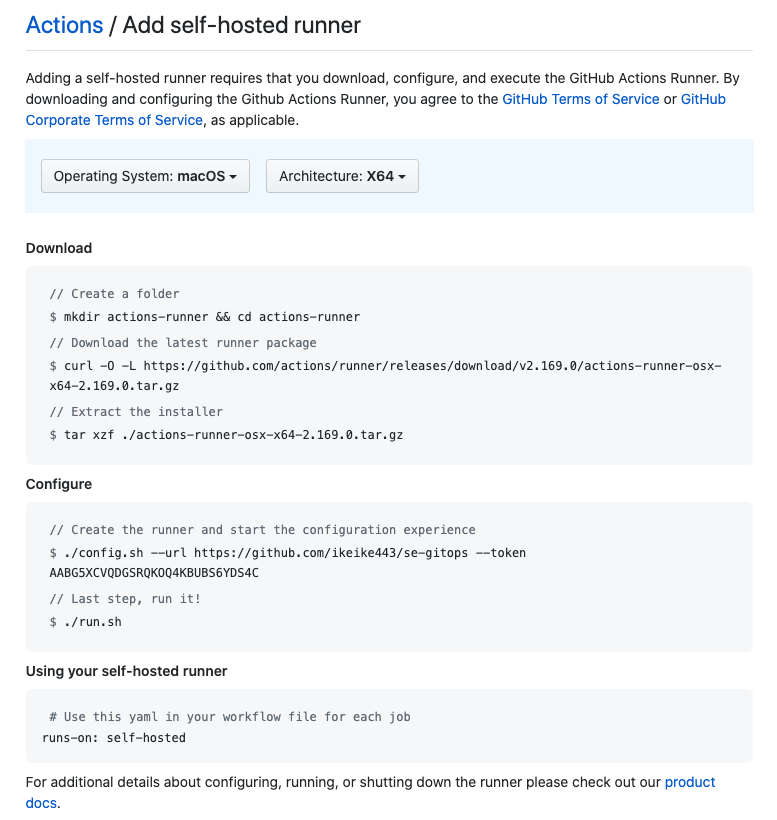
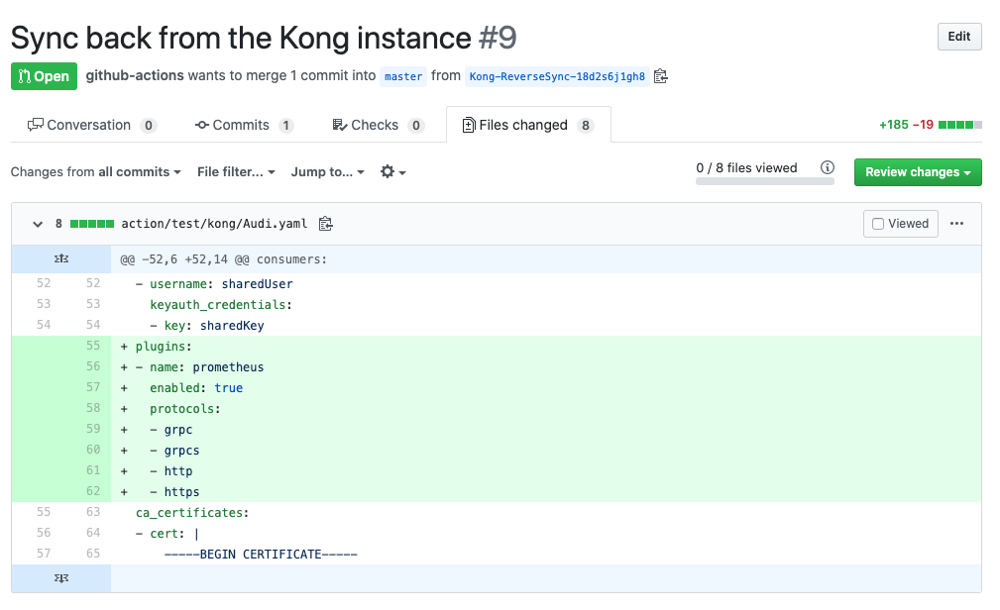

# Template repo for Kong GitOps
This is the customized version of decK-action for a local demo purpose.

This repo is the template repo, so please don't use this direclty. Please create your own repo from this template or even you can fork it if you prefer.

Why you shouldn't use this directly is becuase the self-hosted runner will be tied to each repo, so if you register the runner to this repo directly that will be running on your laptop, that runner will definitely conflict with the other runner that was already registered to this repo by the other SE.

Please create your own from this template instead. :bow:

## Prerequiste
- Make sure your kong demo environment running at localhost:8001
- Install decK v1.1.0 or later on your laptop
- Install git on your laptop
- Make sure you have nodejs v12 environment on your laptop

## How to use this
### 01. With this template, create your own repo that will store your kong config files
### 02. Do git clone the repo you created from the template
### 03. Build this action locally
Execute commands below:
```bash
$ npm i -g @zeit/ncc # if you already installed it, you can skip
$ ./scripts/compile.sh
$ git add .
$ git commit -m "Build action locally"
```
### 04. Rename workflow files
Under `.github/workflows/` you can find three yaml files with `.template` suffix. You can reuse them with deleting the suffix from each.
```bash
$ mv .github/workflows/PR.yaml.template .github/workflows/PR.yaml
$ mv .github/workflows/PUSH.yaml.template .github/workflows/PUSH.yaml
$ mv .github/workflows/Reverse-Sync.yaml.template .github/workflows/Reverse-Sync.yaml
$ git add .
$ git commit -m "Renamed workflow files"
```
### 05. Store your kong config files
Execute comands below:
```bash
$ cd kong
$ deck dump --all-workspaces .
$ cd ..
$ git add .
$ git commit -m "Stored kong config files"
$ git push origin master
```
### 06. Register the self-hosted runner
Go to your repo on GitHub.com through the web browser. Then navigate to "Settings>Actions" and click "Add Runner". 

There you can see below, please follow the guide to register your runner on your laptop:

### 07. All set!
You're all set. 

Let's modify one of config files under `kong` folder and push it to the repo, then open a pull request on the repo. What you will see? 

Let's try to merge the PR, then see what happnes? You will see the canges apply to the kong instance.

### 08. What if you configured Kong through UI?
No problem. After you did it at localhost:8002, then execute the command below:
```bash
$  ./scripts/revrse-sync.sh <YOUR GITHUB TOKEN> <YOUR GITHUB REPOSITORY NAME>
# examle:  ./scripts/revrse-sync.sh blahblahblahblah Kong/se-localdemo-gitops-template
```
Then you can see a pull request open on your repo, like below:


## 🚧🚧 CAUTION 🚧🚧
Please note your Kong configuration may contain sensitive information such as client_credential for OIDC plugin or aws secret for AWS Lambda plugin.  Please take proper pre-cautions to protect your declarative config.

## Parameters you can set

### command
You can set either "ping", "validate", "diff", "dump" or "sync" commands.  Default: `ping`

### options
This field could accept any option parameters the original decK defines.  Please see `deck --help` and `deck <command> --help` for the details.

### kong_workspaces
This is mandatory to specify where the declarative files of Kong are located in the repo.  Default: `kong`

### github_token
This is also mandatory to call several GitHub API inside of the action.  Please set as `${{ secrets.GITHUB_TOKEN }}`

